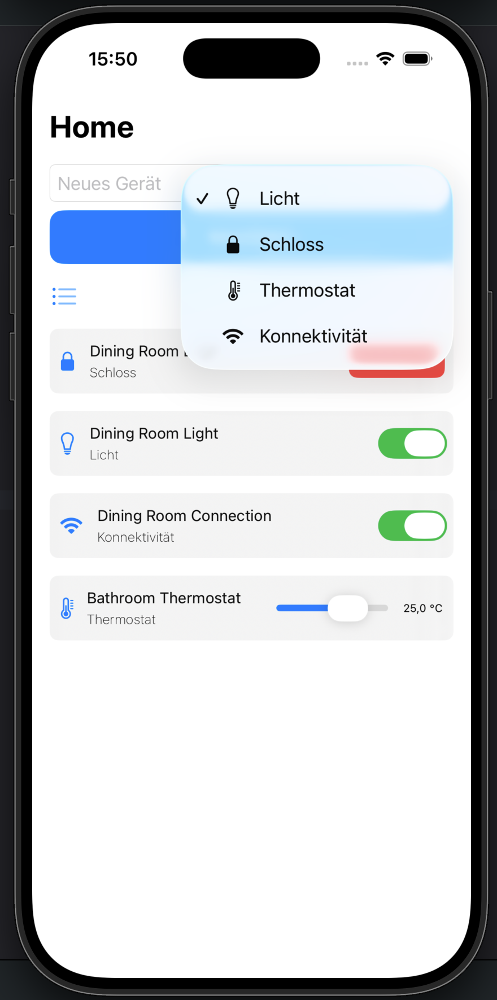
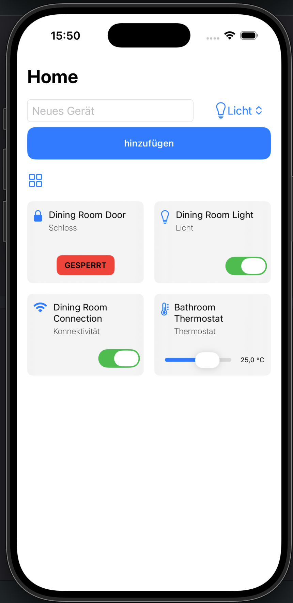

# 🏠 Smart Home App – Week 2 Project

An iOS SwiftUI application that simulates a Smart Home environment, allowing users to manage and interact with different smart devices such as lights, thermostats, and door locks.

---

  
  &nbsp;
  

## 🧠 Project Idea

The goal of this project is to build a dynamic Smart Home simulation using SwiftUI while practicing state management, data modeling, reusable views, and user interaction.

Users can:

* Add new smart devices
* Select different device types
* View devices in a list or grid layout
* Control device states
* Remove devices from the system

The project focuses on creating a clean architecture and responsive UI using SwiftUI.

---

## 🛠️ Tech Stack

* Swift
* SwiftUI
* Xcode
* State Management (`@State`, `@Binding`)
* MVVM-inspired structure (Models / Views)

---

## 🧱 Project Structure

### Models

* Item.swift

### Views

* SmartHomeView.swift

### Subviews
* HomeSubHeaderView.swift
* HomeItemView.swift
* HomeItemListView.swift
* HomeHeaderView.swift
* HomeBottomSheetView.swift

---

## ⚙️ Features

### ➕ Device Management

* Add new smart devices dynamically
* Choose device type using a Picker
* Automatic device list updates

Supported devices:

* 💡 Light
* 🌡️ Thermostat
* 🔒 Lock
* 📶 Connectivity

---

### 🏠 Room Preview

* Interactive room visualization
* Devices displayed according to their type
* Visual feedback based on device state

Examples:

* Lights change color when turned on/off
* Locks display locked/unlocked status
* Thermostats show current temperature

---

### 📋 Multiple Layouts

* List View
* Grid View using `LazyVGrid`
* Easy switching between layouts

---

### 🎛️ Device Controls

Each device has its own interaction model:

#### Light/ Connectivity

* Toggle On / Off

#### Thermostat

* Temperature Slider
* Temperature Gauge

#### Lock

* Lock / Unlock Button

---

### 🔄 State Management

Implemented using:

* `@State`
* `@Binding`
* `ForEach` with bindings

This ensures UI and device data remain synchronized.

---

### 🗑️ Device Deletion

* Remove previously added devices
* Instant UI updates after deletion

---

### 🎨 Modern UI

* Custom room preview
* Rounded corners
* Shadows
* Responsive spacing
* SF Symbols integration
* Dynamic visual feedback

---

## 📚 Concepts Practiced

* SwiftUI Layouts
* State Management
* Data Binding
* Enums & Structs
* Dynamic Lists
* LazyVGrid
* Reusable Components
* Conditional Rendering
* User Input Handling
* SF Symbols

---

## 🚀 Learning Goals

This project was created to practice:

* Building interactive SwiftUI applications
* Managing complex UI states
* Creating reusable components
* Structuring larger SwiftUI projects
* Modeling real-world objects with Swift

---
